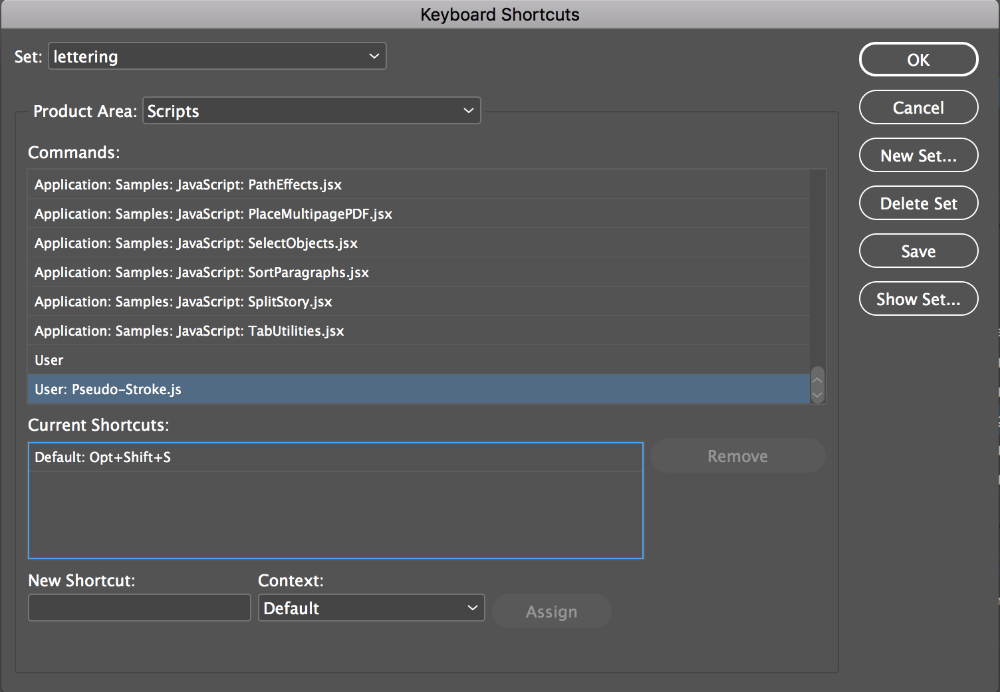
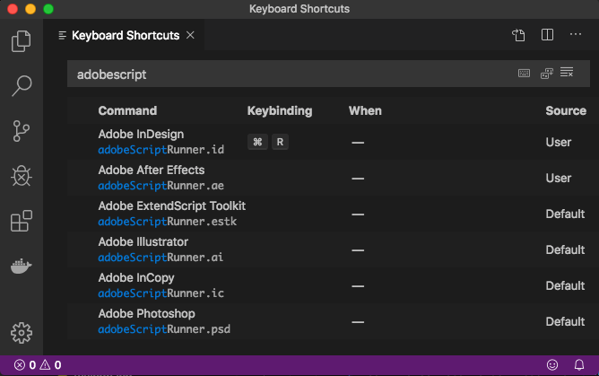
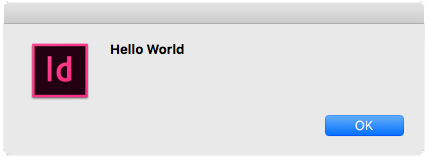

**Contents**
- [How to use scripts in InDesign](#how-to-use-scripts-in-indesign)
- [How to write scripts in InDesign](#how-to-write-scripts-in-indesign)
- [Frequently Asked Questions](#faq)

# How to use scripts in InDesign

> This guide will be using Adobe CC 2019 on Mac OS X, but the overall process should be similar on different versions and operating systems.

## The Fast and Simple Way
1) To locate your Scripts folder, open InDesign. Open the Scripts panel (Window > Utilities > Scripts). Right-click on the **User** folder, and select **Reveal in Finder**. This is where you can save any JavaScript files you want to run in InDesign.

2) Navigate to a specific GitHub script you'd like to download, like [this one](https://github.com/saraoswald/Manga-Scripts/blob/master/Pseudo-Stroke.js). Right-click on "Raw" in the upper right-hand corner of the page, and **Save Link As...**

 

3) Save the JavaScript file in the folder you found in Step 1. When you go back to the Scripts panel in InDesign, you should now see the file.
4) You can run the file either by:
    - Right-click and **Run Script**
    - Double-clicking on the script
    - Assigning the script to a keyboard shortcut (see **Setting up Keyboard Shortcuts** below)

## Setting up Keyboard Shortcuts
Once you have a file available in the Scripts panel, you can assign it to any available keyboard shortcut for easy access. 
1) In InDesign, open **Edit > Keyboard Shortcuts...**
2) Select the **Product Area** as **Scripts**
3) Select whichever script you'd like to assign a shortcut. In the **New Shortcut** field, press your desired keystroke, and then click **Assign** to save it. Finally, click **OK**. 

 

# How to write scripts in InDesign
## Setup
1) Install [Visual Studio Code](https://code.visualstudio.com/)
2) In VS Code, install the [Adobe Script Runner Extension](https://marketplace.visualstudio.com/items?itemName=renderTom.adobe-script-runner#installation)
3) Open Keyboard Shortcuts (On Windows, `File > Preferences > Keyboard Shortcuts` / On Mac, `Code > Preferences > Keyboard Shortcuts`)
4) In the search bar, type "adobescriptrunner"
 
5) Reset the keybinding for `Command/Control + R` to be InDesign. [Refer to this guide for help with binding keyboard shortcuts.](https://code.visualstudio.com/docs/getstarted/keybindings#_keyboard-shortcuts-editor)

## Run a Sample Script
1) Make sure that InDesign is open.
2) In VS Code, open a new text file (`Command/Control + N`), and copy and paste the script below into it:
> alert("Hello World")
3) Press `Command/Control + R` (the shortcut from the setup section above), and you should get this popup in InDesign: 

 

**(optional)** You can also set up the [ExtendScript Debugger extension](https://marketplace.visualstudio.com/items?itemName=Adobe.extendscript-debug) for a true debugging experience, though I've had mixed results attaching it to the InDesign process. 

## Sample Scripts
To help you get started, here are a couple sample scripts. 

**Keep in mind that ExtendScript is based off of a very outdated version of Javascript, so it does not support most modern functions.** Here are some examples of features that are not supported: 
- [Array.indexOf](https://developer.mozilla.org/en-US/docs/Web/JavaScript/Reference/Global_Objects/Array/indexOf)
- [String.trim](https://developer.mozilla.org/en-US/docs/Web/JavaScript/Reference/Global_Objects/String/trim)
- [Array.map](https://developer.mozilla.org/en-US/docs/Web/JavaScript/Reference/Global_Objects/Array/map)
- [Arrow functions](https://developer.mozilla.org/en-US/docs/Web/JavaScript/Reference/Functions/Arrow_functions)
- [Template literals](https://developer.mozilla.org/en-US/docs/Web/JavaScript/Reference/Template_literals)

**Display info about the current active page:**

    var activePage = app.activeWindow.activePage;
    alert('Page ' + activePage.name + '\n'
        + 'Text Frames: ' + activePage.textFrames.length + '\n'
        + 'Graphics: ' + activePage.allGraphics.length + '\n'
        + 'Side: ' + activePage.side.toString() + '\n' 
        + 'Bounds: ' + activePage.bounds);

**Display the contents of all the selected text frames, without line breaks**:

    var selections = app.selection,
        output = "";
    for(var i = 0; i < selections.length; i++){
        if(selections[i] instanceof TextFrame && !!selections[i].contents){
            output += selections[i].contents.replace(/[^\S ]+/g,'') + '\n';
        }
    }
    alert(output);

## Resouces
- [Latest ExtendScript API](https://www.indesignjs.de/extendscriptAPI/indesign-latest/)
- [CS6 Object Model / Class Index](http://jongware.mit.edu/idcs6js/inxx.html)
- [Script UI Guide for Dialogs and Stuff (PDF)](https://adobeindd.com/view/publications/a0207571-ff5b-4bbf-a540-07079bd21d75/92ra/publication-web-resources/pdf/scriptui-2-16-j.pdf)

# FAQ
## Do your scripts only work in CC? 
I only have access to Adobe CC, so that's the only place I'm able to test them. I have no idea if they'll work on your computer, but I try my best not to use features I know aren't supported before CC. 

## Why didn't this script work? 
**Before reaching out to me, please make sure you have correctly installed the script, and that you've read the instructions at the top of the script file.**

I'm only able to test scripts on my own files and workflow, so there are bound to be discrepancies. 

I'm happy to help you figure out what's wrong, but I need the following from you: 
1) What steps make this issue happen?
2) Was there an error message that popped up? What did it say?
3) What version of InDesign are you using? 
4) What operating system are you using (Mac/Windows)?
5) (Optional) A sample file that you can reproduce the issue in reliably

## What tools do you use?
- Adobe CC 2020
- [Visual Studio Code](https://code.visualstudio.com/)
- [VS Code Adobe Script Runner Extension](https://marketplace.visualstudio.com/items?itemName=renderTom.adobe-script-runner)
- [VS Code ExtendScript Debugger](https://marketplace.visualstudio.com/items?itemName=Adobe.extendscript-debug)

I do not recommend using the ExtendScript Toolkit application from Adobe. It's no longer supported in CC, and it's a very clunky experience. 

## Can I use your scripts to write my own? 
Yes, you can use parts of these scripts in your own so long as you: 
1) Do not sell them
2) Credit me

## Can you write an InDesign script for me?
Sure! Feel free to shoot me a DM on [Twitter](https://twitter.com/salinsley). 
