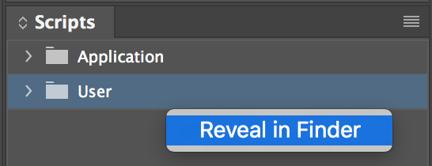

# How to use scripts in InDesign

> This guide will be using Adobe CC 2019 on Mac OS X, but the overall process should be similar on different versions and operating systems.

## The Fast and Simple Way
1) To locate your Scripts folder, open InDesign. Open the Scripts panel (Window > Utilities > Scripts). Right-click on the **User** folder, and select **Reveal in Finder**. This is where you can save any JavaScript files you want to run in InDesign.

2) Navigate to a specific script you'd like to download, like [this one](https://github.com/saraoswald/Manga-Scripts/blob/master/Pseudo-Stroke.js). Right-click on "Raw" in the upper right-hand corner of the page, and **Save Link As...**
 
3) Save the JavaScript file in the folder you found in Step 1. When you go back to the Scripts panel in InDesign, you should now see the file.
4) You can run the file either by:
    - Right-click and **Run Script**
    - Double-clicking on the script
    - Assigning the script to a keyboard shortcut (see **Setting up Keyboard Shortcuts** below)

## Setting up Keyboard Shortcuts
Once you have a file available in the Scripts panel, you can assign it to any available keyboard shortcut for easy access. 
1) In InDesign, open **Edit > Keyboard Shortcuts...**
2) Select the **Product Area** as **Scripts**
3) Select whichever script you'd like to assign a shortcut. In the **New Shortcut** field, press your desired keystroke, and then click **Assign** to save it. Finally, click **OK**. 
 